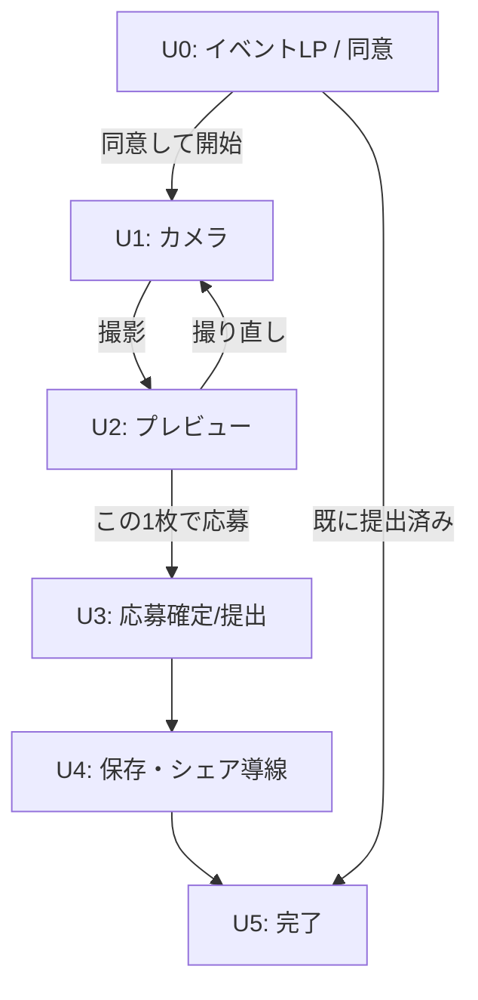

# 画面一覧と遷移図

## 1. 参加者（User）画面

| 画面ID | 説明 |
|--------|------|
| U0 | イベントLP（同意→撮影開始） |
| U1 | カメラ（撮影/撮り直し） |
| U2 | プレビュー（合成結果） |
| U3 | 応募確定（提出1回ロック） |
| U4 | 保存/シェア（キャプションコピー、IG/X誘導） |
| U5 | 完了（再アクセス時は「提出済み」） |

### 参加者 画面遷移図（Mermaid）

---

## 2. 主催者（Admin）画面

| 画面ID | 説明 |
|--------|------|
| A0 | ログイン |
| A1 | イベント一覧 |
| A2 | イベント作成（10分セットアップ） |
| A3 | イベント編集（文言・ハッシュタグ・同意文言・SNS導線） |
| A4 | フレーム管理（アップロード/プレビュー/差替） |
| A5 | QR管理（入口別QR / ワンタイムQR） |
| A6 | ダッシュボード（scan/capture/save/outbound/submit） |
| A7 | 応募一覧（同意有無/候補タグ/DL） |
| A8 | エクスポート（CSV） |

### 管理画面 遷移図（Mermaid）

